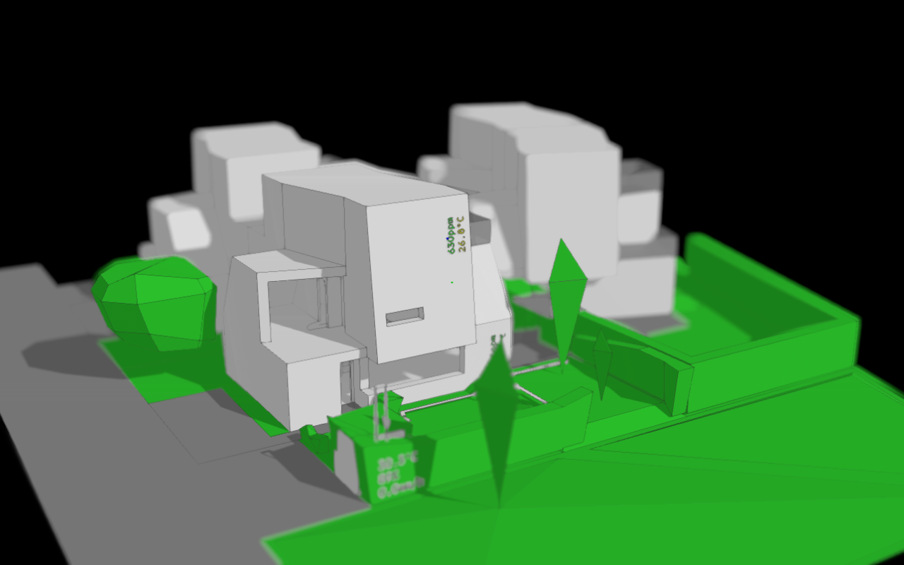

# POC implementation for a digital twin of my small house using homeassistant and various MQTT devices.

flaws:

OK interesections do not consider clipPlane
OK add radiation sensor through homeassistant (no radiation entity found in HA)
OK labels only work when vertical
OK introduce a second reference point so focus to that point can be preserved while navigating
OK store a wfocus point for each camera key and animate like camera pos
OK restore orbit center after animation
OK filter intersections by height only on instances having cli materials
OK add UI for "devices", pumps, switches, ...
OK page becomes unresponsive after a while (maybe after many text updates) :: texts were updated too often, dispose of geometry was added, text geometry resolution reduced
OK when using forecast early hours become unavailble later in the day and light intensities become negative, likely due to naive interpolation :: swapped to different forecast
OK reduce weather information to maybe a single symbol
OK have HUD/sprite elements for lights
-- show connection state of sensors, switches
-- lights rendering only in dark mode (?), find another way for during the day
-- improve IStatusHandler interface (maybe have types that have commands, i.e. toggle or status, and flexible UI elements for different types)

possible improvements:

OK add the gif exporter
-- indicate rain
-- moonlight (and moonphase if somehow possible/feasible)
-- progressive shadowmap to show lightshed over a full day
